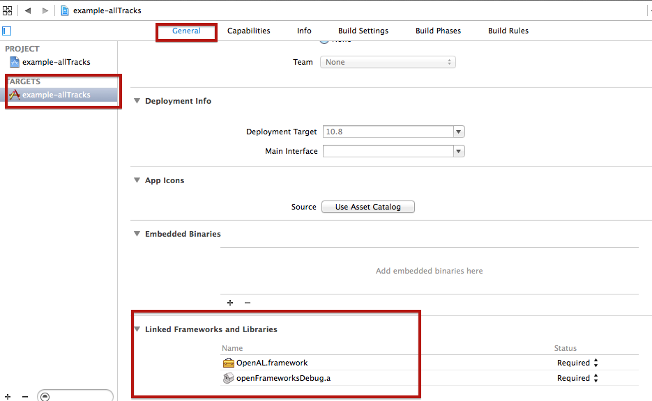

source: https://forum.openframeworks.cc/t/cant-use-ofxtimeline-with-0-9-0/22076/9

1-
In order to make the audio run I had to modify the up-to-date 'ofxAudioDecoder' like this: https://github.com/kylemcdonald/ofxAudioDecoder/issues/5
changing to #ifdef TARGET_OF_IOS instead of #ifdef TARGET_OF_IPHONE:

2-
Rename all the 'testApp' to 'ofApp' (filenames and content of them), and update each project with ProjectGenerator. Sometimes I had to re-add the 'ofxAudioDecoder' addon dragging it manually because some lib errors...

3-
On the project tab / building settings, you have to add the lines 'TIMELINE_AUDIO_INCLUDED=1' & 'TIMELINE_VIDEO_INCLUDED=1' (if used) on 'Preprocessor Macros':

4-
On the '/src/ofApp.h' of your project file, you have to add the lines:
#include "ofxTLAudioTrack.h"
#include "ofxTLVideoTrack.h"

5-
If you want to do audio you need to add the 
